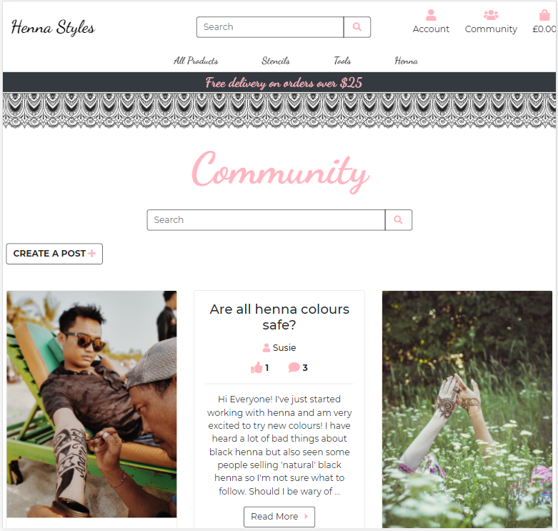
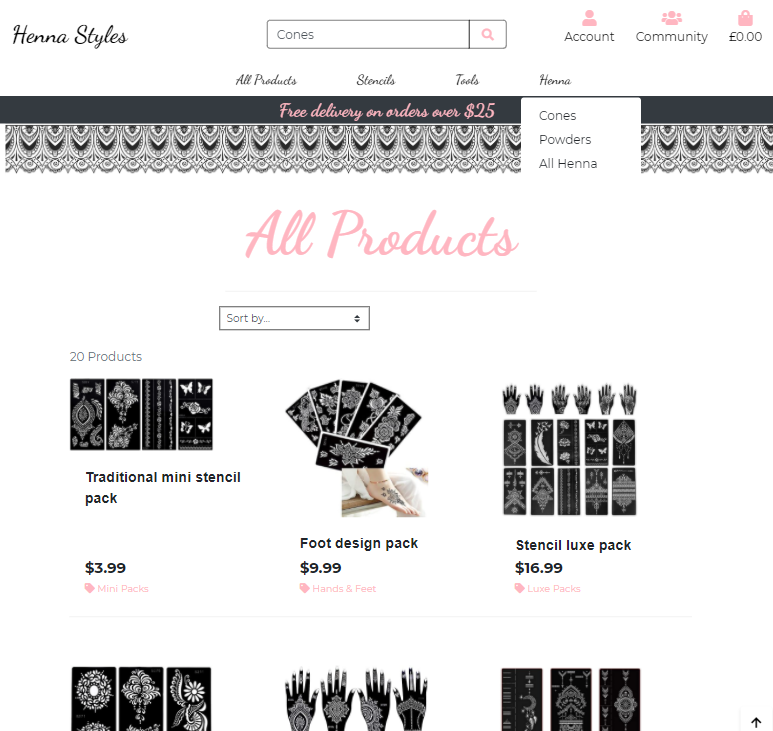
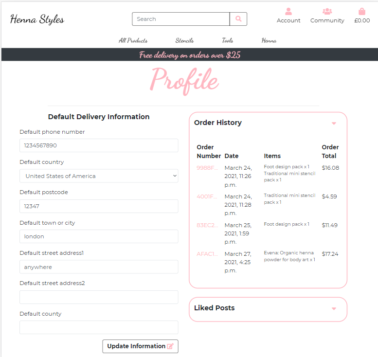
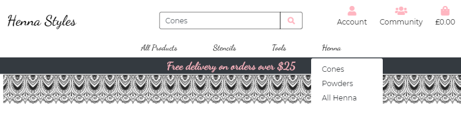
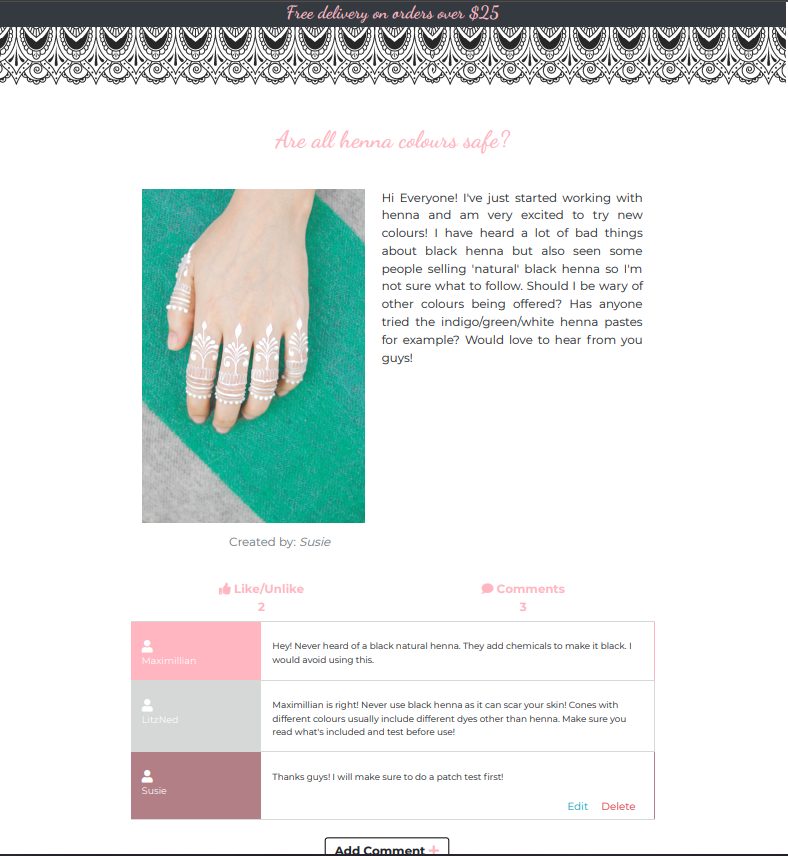
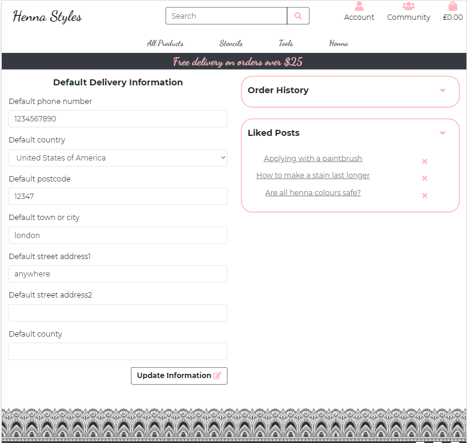

# __Henna Styles__

The past year of worldwide lockdowns has inspired many people to take up new hobbies and attempt beauty treatments at home,
 as they could no longer visit professionals. Henna Styles is an online henna shop and art community, which provides a range 
 of henna products visitors can purchase as well as providing a platform for people interested in henna design to improve their
 abilities and learn from each other.

- - - 

## __UX__

### __Value provided:__
#### __For users:__
- As a visitor with no previous experience with henna I would like to know more about it before purchasing.

- As a new user I want guidance on how to use the products effectively

- As a professional user and want to find a range of products in one place

- As a user who has some previous interest in henna I want to know what I have purchased before so I can repurchase easily

- As a professional user I want to see others work for inspiration

#### __For store owner:__ I want to maximise sales.
- I want to make sure all visitors know the range of products being sold.

- I want the user to have a positive response to the site and spend longer on it as this will motivate return visits.
  
- I want to increase the number of visitors who return to the site in order to gain repeat purchases.


### __Wireframes__
This section is also where you would share links to any wireframes, mockups, diagrams etc. that you created as part of the 
design process. These files should themselves either be included as a pdf file in the project itself (in an separate directory),
 or just hosted elsewhere online and can be in any format that is viewable inside the browser.
 
+ [Home wireframe](documentation/wireframes/home-wrf-img.PNG)
+ [Shop wireframe](documentation/wireframes/shop-wrf-img.PNG)
+ [Community wireframe](documentation/wireframes/community-wrf-img.PNG)
+ CHECKOUT view
+ PROFILE view
+ Add/Edit post view

### __Overall design__
+ In order to get an idea of the conventions of shopping/blog art sites I visited several online stores. The styling is simple
 when displaying products but other pages are loaded with colour and images, creating a positive response. Several of the more popular art 
 supply shops had sections which contained information and blog posts (like jackson art). I also viewed some online henna shops 
 which appeared to be for smaller companies as the style was very simplistic and none offered all the different types of products 
 offered on Henna Styles. Some of the sites used for inspiration include: [Jackson art](https://www.jacksonsart.com/),
 [Desenio](https://desenio.co.uk/), [Henna Shop](https://www.hennashop.co.uk/).

+ The colour scheme used for the site was created with coloors. The colours are simple including black, gray and shades of pink,
this was chosen in order to keep the pages simple while still vibrant and allow image pages to create a strong response in 
comparison. [Palette used](https://coolors.co/ffb6c1-d6d7d7-b27f87-210124-00171f).

- - - 
## Database Schema

Sql was used to create this database.

## ADD IMAGE OF DATABASE SCHEMA

---- 
## Features

### Sitewide Features:

- __Navigation bar:__
    - Top navigation bar is styled with the sites theme colours and contains 5 links. 
        - The first is the site logo which leads to the homepage. 
        - The next is the search bar, which allows users to search for products from anywhere on the site. 
        - The Account link is next, this displays links relevant to the current user. For anonymous users,
        the links avaliable are 'register' and 'login'. For authenticated users the links avalaible are 'my profile' and 'logout'.
        Superusers will also have access to 'product management' from the account section, where they can add products.
        - The Shopping bag link is next, the shopping bag totals are displayed and updated each time the user
        adds an item to their shopping bag.
        - The final link is for the community page
    - __Bottom Navigation bar:__
        - contains links to different product searches. The user can select a product category, subcategory or choose to 
        display all products by a preferred sorting method, such as low to high prices. 
        This part of the navigation bar is displayed in full on larger screens but toggles on small screens. 
        On small screens a home link is also displayed.
- __Delivery banner__ reminds user of the free delivery limit, which may incentivise them to buy more.
- __Pattern Borders__ decorate most pages, they are reminiscent of patterns created with henna and fits the site theme.
- Footer
    - Contains links to social media 
- Toasts
    - Toasts are displayed throughout the site based on user interactions. A summary of the bag is displayed when users alter
    its content. Errors and important general information is also displayed through toasts.

### Homepage:
- __Header image__ is of a desgin being created with henna. The hand being decorated is shown on an ornate box, with complex designs.
    The colours are dark and contrast with the rest of the site, drawing the users attention.
- __Heading and intro__. The heading is a large welcome message in the logo font and theme pink colour. The intro explains to the user
what is avalaible on the site. Henna products for purchase and a blog with further information and potential for interaction with other users.
- __Buttons__ Two buttons are avaliable on the homepage. One for shop and one for community. This guides users to either make a purchase 
or view the community page where they can gain some inspiration, which hopefully will lead them to purchase the products.

### Products pages:

- __All Products__
    - __Sorting dropdown selector__ allows the user to choose from a selection of sorting methods.
    Once a method is selected, the products are update and a link to 'products home' appears which allows them to reset the search, 
    they are also able to select a new search method from the selector if they like.
    - __Navigation category selection__ when a product category is selected from the navigation bar. All products
    in this category are displayed, links to subcategories are also displayed below the heading, allowing users to 
    narrow their search down further. Again, the product home link is avaliable on these pages to reset the search and 
    the sorting methods to organise the results.
    - __Product Results__ are made up of a large product image, the product name and price and a link to the category
    the product belongs to. Selecting a product takes the user to a product details page.
    - __Edit delete buttons for superuser__ When the user is a superuser, edit and delete links appear under each product allowing 
    them to easily edit and remove products from the site.

- __Product Details__
    - __Large product image and product details__ allows user to see details of the product clearly.
    Users can read the full product description and again, select the products category to view more products in the same category.
    - __Quanity selector__ allows the user to increase/decrease the quantity of the product they wish to purchase. The 
    value cannot be set below 1 so no errors occur when the product is added to the bag.
    - __Add to bag button__ adds the product to the shopping bag.
    - __Success toasts__ when a product is added to the page a toast pops up letting the user know they have 
    successfully added the product to the bag and also allows them to view a summary of what is currently in their bag as 
    well as the total due excluding delivery, and what they need to spend to get free delivery. Clicking on the toast takes the 
    user to their shopping bag and allows them to continue with the purchase.
    - __Keep Shopping button__ Allows the user to return easily to the main products page.

- __Edit/Add products__ these pages are only avaliable to superusers.
    - __Product Form__ consists of all fields required to create a new product. Category is selected through a drop down, containing 
    all categories. Edit form is prefilled with the product details so users can make edits quickly and easily.
    - __Product Image__ users are notified when uploading a new image what the file will be changed to, so they can see if a mistake is made.
    When the user is editing a product the current product image is shown as a preview.

### Shopping Bag page:
    - __Products__ that have been added to the shopping bag are displayed along with relevant information, such as colour and quantity. 
    - __Update/Delete buttons__ Users can adjust the quantity of an item in their bag or remove it completely.
    - __Secure Checkout button__ takes the user to the checkout page where they can finish the transaction.

### Checkout page:
- __Order Summary:__ Shows the user their shopping bag and a breakdown of their order, delivery and total costs, before they complete their purchase.
- __Form__: Split into three sections, if any required fields are missed, the form cannot be submitted. Instead a popup appears at the missed field 
reminding the user to fill it in before submitting again. 
    - The first contains the users information such as email and name. 
    - Delivery information is the next section. If the user is logged in they are able to save this information so next time they make 
    a purchase, this part of the form will be prefilled. 
    - Stripe payment is the last section where users enter their card details and can complete their purchase. The 
    form cannot be submitted if the credit card number is not valid, instead the page will reload, alerting them of the 
    issue.
- __Loading overlay__: This is triggered when the form is submitted and shows the user their request is being processed. It consists of a 
black transparent overlay and a spinning loading icon in site colours.

### Checkout Success page:
- __Success toast__ assures the user their order has been processed, gives them the order number and alerts them that they have 
been sent a confirmation email. 
- __Heading and intro__ thanks the user for their purchase and confirms the email their order confirmation has been sent to.
- __Order summary__ shows all the order details including the order number, date, products purchased, delivery information and 
billing information.
- __Back to shop or community buttons__ guides the user to other parts of the site they can explore.
- If users have logged in when making purchases they will be able to access old order confirmations through their profile page, 
they are alerted through a toast that they are viewing a previous order. A link to go back to their profile page is also provided for these
users.

### Community pages:

- __Community page__ is avaliable for all users to view, however adding posts and comments is restricted to authorised users, any visitor to 
the page is made aware of this through a toast popup.
    - __Search posts__: Users are able to search for posts using keywords they are interested in. Submitting the search will return
    all relevant posts and also display a reset button to allow them to return to the main view.
    - __Add Post button__: Avaliable at the top of the page so users can find it easily, takes the authenticated users to the add a post page
    and anonymous users to the login page.
    - __Posts__ consist of cards containing the post image, if it has one. The user who created it and a preview of the post so users can get an idea if it is 
    what they are looking for. The posts end with a button leading to the full post.
    - __Like and comment count__ On each post the number of likes and comments is also displayed so users know if there are comments to read 
    or whether or not the post is popular.
    - __Edit/Delete Buttons__ are only visible to the creator of the post, allowing them to remove or edit it. Delete post buttons are also 
    avaliable to superusers in order to allow them to regulate what is posted.

- __Post detail page__ avaliable for all users to view, however adding comments or likes is restricted to only authorised users.
    - __Post heading, image and body__: The heading is styled using the logo font. For posts with images, the image is displayed prominently and
    the full post is avaliable to read.
    - __Like button__: Shows the current number of likes. It also allows logged in users to like or unlike a post, which triggers a page reload 
    with a toast notifying the user that their like has been added and the like count will also increase.
    - __Comment button and form__:When pressed, by an authenticated user, toggles a collapsible at the bottom of the page with the comment form so the 
    user can add a comment.
    - __Comments__: Show the comment author section in different colours, depending on if they are a superuser, the post creator or a general user. 
        - __Edit/Delete buttons__ are avaliable to the creators of comments. The edit button produces the comment form, prefilled and allows the user to make 
        an adjustment. The delete comment button is also avaliable to superusers to allow them to regulate comments.
        
- __Add/Edit a post page__ is displayed simply with the logo font used for the heading and the pattern border page decoration.
    - __Post Form__ cannot be submitted without being fully filled in. The name of the file image chosen for the post is displayed once 
    one is selected. Edit form is prefilled for ease of adjustment and a pop up toast appears when the page is loaded alerting the user that 
    they are editing their post.

### __Profile page:__ is only avaliable when a user is authorised and they only have access to their own profile page.
    - __User Profile Form__ allows a user to add/adjust their default shipping information to make checkout faster and easier.
    - __Order Summary__ is originally hidden when the page is loaded. Allows the user to bring up a summary of their previous orders 
    as well as select an order to view it's confirmation and full details.
    - __Liked Posts__ are orginially hidden when the page loads. Allows a user to view the heading of their liked posts so they can return to them easily, 
    they are also able to remove the like and therefore the post from their profile.

### __Security Features:__
- All forms must be submitted with all required fields filled or they will not be put into the database
- Only authenticated users are allowed to create posts, if an anonymous user types the correct url they will be diverted to the login page. Only the
post creator is allowed to edit the post so others can't tamper with their post.
- Only authenticated users are allowed to add comments and likes, prevents any user from adding to the database.
- All auth is used for user verification, an anonymous user cannot access another users profile page.

## Features Left to Implement 
- Adding alerts to user's profile when someone comments on a users post
- Add ability to log in through social media

## Technologies used 
 - __Balsamic__ was used to create the wireframes for this project.
 - __Html 5__ was used to create the templates for the site.
 - __Bootstrap__ was used to structure HTML and for some responsive components.
 - Jinja was used to to templates
 - __Python__ was used to write the logic for the app
 - __Javascript__ was used to add interactive features to components
 - __CSS__ was used to style the site
 - Django was used 
 - All Auth
 - __Stripe__ was used to handle payments for the store
 - __Heroku__ was used to host the deployed site.
 - __Heroku Postgres__ was used to hold database
 - __AWS__ was used to store website images and static files
 - __FontAwesome__ was used for it's icons throughout the site
 - __Googlefonts__ was used for the logo font and main site font
 - Html validator
 - Pylint for Django

## Testing

VALIDATOR RESULTS

### TESTING USER STORIES NEEDS ARE MET

- As a visitor with no previous experience with henna I would like to know more about it before purchasing.
    - The homepage will address this as soon as a visitor lands on the site. The homepage will contain a link to the community 
    section and shop so visitors can find further information if they need to before they buy.
    
- As a new user I want guidance on how to use the products effectively
    - The community section will address this. People will be able to view henna related posts from other users or site owners and search for 
    posts on specific topics using the search bar on this page. Knowing more will encourage them to make purchases and experiment 
    with extra products. In order to ask questions of the community however they will have to create an account.
    
- As a professional user and want to find a range of products in one place
    - The homepage will contain a link to the shop and the types of different products will be displayed on the navigation bar 
    throughout the site so visitors can find what they are looking for quickly from anywhere. The navigation bar contains a range of
    ways to locate the product you need quickly, including categories, subcategories and the product search bar.
    
- As a user who has some previous interest in henna I want to know what I have purchased before so I can repurchase easily
    - When making a purchase, customers can create an account which will hold their preferred shipping details and an order history. 
    This will be available only by logging in when making a purchase.
    
- As a professional user I want to see others work for inspiration
    - Community page will allow people to view others' work, however to gain the full effect of the community (respond to 
    and create posts), users will have to log in.
#### __For store owner:__ I want to maximise sales.
- I want to make sure all visitors know the range of products being sold.
    - Site navigation will contain the main categories of products sold and will be available throughout the site. Users can choose
    whether to look through all the products or search for something specific.
    
- I want the user to have a positive response to the site and spend longer on it as this will motivate return visits.
    - Users will be able to view the community page where they can interact with others which will produce a positive response and 
    lead them to stay on the site longer. They are made aware that they must create an account to access all actions when first visiting 
    the community page.
    
- I want to increase the number of visitors who return to the site in order to gain repeat purchases.
    - The profile page contains an order history and liked posts. Customers are likely to return again if they liked a product to 
    repurchase it. Also if the user has chosen to engage with the community, they are more likely to return to see more posts or 
    view replies to their posts or comments. 
    

## Testing functionality and responsive design

### Site wide features
- __Navigation bar:__ to test this I manually pressed each link on the nagivation page, both as an anonymous user and as an existing
 user as the links avaliable are different. The process below was repeated on both large screen versions of the site and mobile to 
 ensure the toggle menu was working well.
    - __Functionality:__ Before logging in:
    I clicked on each link on top navigation. 
    The logo led to the homepage successfully, the accounts button produced a dropdown when clicked which gave the options of "Register" and 
    "Login", both links led to the correct page. The shopping bag button led to the shopping bag page, the community button led to the community 
    page. To test the search function worked, I typed in 'cones', which is a word used in several products, this led to the products page with the
    products filtered to only show those containing the word. 
    Next I clicked each link on the product navigation.
    Each category link displayed a dropdown of subcategories when pressed, I pressed the link for each subcategory and the product results 
    adjusted correctly based on the subcategory.
    - Functionality: After logging in:
    I clicked on the account button, where the links displayed were "My Profile" and "Logout", both when selected led to the correct page.
    -Responsive design:
    The toggle button displayed on smaller screen widths, produced the products nagivation when pressed and all links were functional.

- __Footer:__ to test this I selected each link to ensure they led to the correct page and opened in a new tab.
    - Functionality: Each link led to the correct social media platform and opened in a new tab.

### Homepage

- __Header image, heading and intro__
    - __Responsive design:__ to test this, I used the google developer tools to view the website on different screen sizes.
    I viewed the image to ensure it was displaying well. The image resolution was good on all screen sizes.
    The welcome text size was reduced on smaller screen sizes.
- __Buttons__ 
    - __Functionality:__ I pressed on each of the buttons. The shop button led to the products and the community button to the 
    main community page.
    - __Responsive design:__ The buttons stacked on mobile screens and where displayed side by side on tablet and laptop.
    
### Products page
- __Sorting dropdown selector__ to test this I selected each option from the product sorting drop down to see the results.
    -__Functionality:__ The sorting worked for all of the sorting options (price, category and name). The results were organised
    as selected. The selector was functional no matter what the category of products currently being displayed where or when the product results 
    were from a search query. The 'product home' button appeared as expected when product sorting or filtering had taken place and 
    reset the product page when pressed.
- __Product Results__ 
    -__Functionality:__ was tested by ensuring all product information was appearing correctly. I pressed the link to the product 
    category under each product which led to the products page, displaying all products in that category. I pressed on the product
    image which led to the product's details page.
    -__Responsive Design:__ I viewed the products page on different screen sizes. The products appeared in a row of four on extra large
        screens, three in a row on laptops, two on tablets and one per row on mobile screens. 
- __Edit delete buttons for superuser__ to test this I logged into the site as a superuser, the products edit/delete links were under
    all the products and led to the edit page for that product with the information prefilled. I added a test product and was able to 
    delete it using the delete link.

- __Product Details__ to test this I repeated the procedure below with a product with no colour options and one with colour option.
    - __Large product image and product details__ 
        -__Functionality:__ I pressed the image which opened up the image in a new tab.
        -__Responsive Design:__ Product image displayed well on all screen sizes, maintaining the ability of users to see finer
        product details. Image stacked over product details on smaller screens and was displayed beside them on tablet screens and
         above.
    - __Quanity selector__ 
        - __Functionality:__ 
            - I pressed the minus button on the quantity form when the current number was one, to ensure a quantity of 0 couldnt be set by the selector, 
            the quantity didn't change.
            - I pressed the increase button and the quantity went up.
            - I changed the current value of the selector to 99 and pressed the plus button again as this was the maximum value set,
            the quantity didn't change.
            - I changed the current value of the selector to 100 and tried to submit the form, the result was a popup at the quantity
            input telling me the value must be less than or equal to 99.
            - I changed the current value of the selector to 0 and tried to submit the form, the result was a popup at the quantity 
            input telling me the value must be greater than or equal to one.
            - I set the current value to 3 and added the product to the bag, the quantity was reflected in the shopping bag and current total.
    - __Colour selector__:
        - __Functionality__:
            - I selected a colour for the product and added it to the bag, a toast appeared showing the product with the colour detail had been 
            added to the shopping bag.
            - I selected a different colour of the same product and added it to the bag, the product displayed seperately with the correct colour shown 
            in the details.
    - __Add to bag button and success toasts__ :
        - __Functionality__: 
            - I pressed this button, a toast appeared at the shopping bag icon in the navigation alerting me the product had been
            added to my shopping bag and a summary of the bag was also shown with the correct product and quanity/colour specifications inside. 
    - __Keep Shopping button__:
        -__Functionality__:
            - I pressed this button and was directed back to the products homepage.

- __Add products__ this page is only avaliable to superusers.
    - __Security:__
        - To ensure the page is secure, I tried to access the page as an anonymous user by typing the correct url, this led me to the 
        sign in page. I signed in with a user who is not a superuser and I was directed to the homepage with a message saying "Sorry,
        only store owners can add products".
    - __Product Form__ after signing in as a superuser.
         - I tried to submit the form with a required field left unfilled, a popup appeared by the missed field asking me to fill it in.
         - I tried to submit the form with an invalid price and was redirected back to the form with a message saying the product couldn't 
         be added and asking me to check over the form. The price field was red and a message under it explained the number must be 
         under 6 digits.
         - I filled in all required fields and submitted the form. I was redirected to the product details page of the new product with
         a success toast pop up telling me the product had been added.

- __Edit products__ this page is only avaliable to superusers.
    - __Security:__
        - To ensure the page is secure, I tried to access the page as an anonymous user by typing the correct url, this led me to the 
        sign in page. I signed in with a user who is not a superuser and I was directed to the homepage with a message saying "Sorry,
        only store owners can edit products".
    - __Product Form__ after signing in as a superuser.
         - I selected a product to edit, the form loaded prefiled with the product information and a message telling me the name of the 
         product I am editing, I deleted a field and tried to submit the form. A pop up appeared at the missed field telling me to fill it in.
         - I filled in a field with invalid information, when the page reloaded I got a message telling me the product couldn't be added and 
         to recheck the form.
         - I filled in the form with all valid information and submitted it, I was directed to the product's product detail page, with a 
         success toast telling me the product had been updated. The changes made in the form were correctly reflected in the product details.
    - __Preview image__:
        Preview image appeared as expected. Selecting the clear checkbox removed the image when the form was processed. 

    
### Shopping Bag page:
- __Products:__ 
    - __Functionality:__ I added three items to the bag with colours and without and the right products, quantities and colours were
    displayed on the shopping bag page.
    - __Responsive Design:__ The product in the shopping bag are displayed through a table on larger screens with the totals due and checkout 
    button below the summary. On smaller screens, the totals and checkout button are at the top of the page and the summary is displayed below 
    this so a user doesn't have to scroll all the way to complete their purchase.
- __Update/Delete buttons__ 
    - __Functionality:__
    - I changed the quantity of one of the products and pressed the update link below the product, a popup toast 
    appeared notifying me that the item quantity had been changed. The quantity input value had changed and the shopping bag
    total asjusted accordingly.
    - When trying to set the values above and below the maximum values set on the quantity input, the order was still processed despite 
    the javascript appearing on the page and being the same as the fully functional quantity selector on the product details page. When 
    the value is set below one the product is removed from the page but users can add over 99 of the product to the bag. This will be 
    reflected in the price which should alert the user. For more on this issue, please view the Bugs section.
    - I pressed the remove link under one of the products and a pop up appeared notifying me that the item had been removed, the
    product was no longer on the shopping bag page and the total value adjusted correctly.
- __Secure Checkout button__ 
    -__Functionality__:
    - I pressed the checkout button with one item in the shopping bag and was directed to the checkout page with the relevant 
    product in the order summary.
    - I opened the shopping bag page with no products in the bag and the button wasn't displayed.

### Checkout page:
- __Responsive Design:__
    - On large screens the page is divided into two columns with the checkout form on the left and an order summary on the right. 
    On smaller screens the order summary is stacked above the checkout form so users will see their bag before completing the 
    purchase.
- __Order Summary:__ 
    -__Functionality:__
     - I checked whether all the information shown on the order summary was correct including product information and checkout 
     totals. All the information was the same as in the shopping bag I had just created.
- __Form__: 
    - __Functionality__:
        - I tried to submit the form with a required field not filled in. A popup appeared by the field which had been
        missed asking me to fill it in.
        - I tried to submit the form with an invalid email, the form reloaded with an error message at the bottom 
        telling me the email address I submitted was invalid.
        - I tried to submit the form with all required fields filled but with an invalid card number, when I had entered
        full number the input turned red and a message appeared underneath telling me the card number is not valid.
        - I submitted the form with all requried fields and a valid card number and was redirected to the checkout success page
        with an order summary for that order. I then checked the order had been created in the database.
        - I filled the form with all requried field and valid card number and pressed the checkout button, then closed the page 
        immediately before the checkout success page could load. This should not be an issue as the order should be created by the
        webhook set up with stripe. I reopened the site and checked the admin, the order was successfully added.
-__Delivery information__:
    - As a logged in user with no previous purchase:
        - The form was empty when loaded, I filled in the required fields and completed the purchase unchecking the save info box 
        before submitting. The order was successfully processed and when I returned to my profile I found the form was still empty.
        - I filled in all the required fields and completed the purchase, leaving the save info checkbox checked.
        I was redirected to the checkout success page with a popup toast confirming the order was successful. I checked 
        the profile page and found the details had been saved.
    - As a logged in user with a previous purchase:
        The delivery information was prefilled based on what I had entered for the previous purchase.
    - As an anonymous user:
        The form was empty and a link appeared below asking me if I want to register or login to save the information.
-__Stripe__: only currently functional with the test card number provided by stripe.
    - __Functionality__: 
        - I filled in the form with all valid information and the test card number from stripe which requires no further authentication.
        I submitted the form and checked the stripe website to see whether a webhook had been sent. I could see that the payment intent
        had succeeded and the card had been charged the correct amount.
        - I filled in the form with all valid information and the test card number from stripe which requires futher authentication. I
        selected the 'fail authentication' button which bought me back to the form with a message at the bottom telling me that 
        my payment method couldn't be authenticated. The payment intent had failed on stripe and no order was created.
        - I filled in the form with all valid information and the test card number from stripe which requires futher authentication. I
        selected the 'authenticate' button which bought me back to the checkout success page with an order confirmation. I checked 
        stripe and the purchase was successful.
- __Loading overlay__:
    - __Functionality__:the overlay appeared on the screen with the rotating reload sign. I repeated the process on mobile and the 
    effect was the same. The overlay remained on screen when extra authorisation was required by stripe and disapeared when the 
    form was fully submitted.

### Checkout Success page:
- __Success toast__ 
    - __Functionality__:
        -  I completed a purchase successfully and was directed to the checkout success page where a popup toast with a success 
         message notified me of my order number and email the confirmation would be sent to, as expected.
        - __Logged in user, accessing page through order history__: the checkout success page loaded with a popup toast with an 
        info message notifing me that I was viewing a previous order and that a confirmation email was sent on the order date.
- __Order summary__:
     - I checked whether all the information shown on the order summary was correct including product information and checkout 
     totals. All the information was the same as the order I had just created.
- __Back to shop/community/profile buttons__
    - When the page is loaded after a successful checkout, the buttons avaliable to me were 'back to shop' and 'community'. 
     I selected the first link in a new tab which led me to the products page, I selected the second in a new tab which 
     led me to the community page. The result was the same for both authenticated and anonymous users.
    - When page is loaded from a users profile, for a past order, the link avaliable is for return to the profile page, I selected 
    this and was redirected back to the profile page successfully.

### Community pages:

- __Community page__ 
    - As an anonymous user, when the page is loaded, a toast appeared informing me that I must log in to add posts or comments.
    - __Responsive Design:__
        Posts appear three in a row on large screens, two in a row on tablets and stacked on mobile view. This is to ensure the 
        text remains readable on all screen sizes.
    - __Search posts__: functionality is the same for authorised or anonymous users.
        -__Functionality__:
         - I typed the word 'cones', which appears in one post, into the search bar and checked to see the resulting post had the 
         word included. The reset search button appeared and when pressed led to the main community page.
         - I typed the word 'henna', which appears in two posts, into the search bar and checked to see the correct posts were 
         displayed. 
    - __Add Post button__:
        - __Functionality:__as an anonymous user
            - I selected the Add Post button and was redirected to the login page.
        - __Functionality:__as an authenticated user
            - I selected the Add Post button and was redirected to the Add a post page.
    - __Posts__ : functionality is the same for anonymous and authorised users.
        - __Functionality:__ Posts appeared correctly and the "Read more" button at the end of the post led to the correct
         post detail page.
    - __Like and comment count__:
        - __Functionality:__ Like and comment count for the posts were accurate.
    - __Edit/Delete Buttons__
        - __Functionality__: as anonymous user
            - The buttons for edit/deleting a post were not present. When typing the correct url to edit a post, I was redirected 
            to the login page.
        - __Functionality:__ as a logged in user
            - The buttons for edit/deleting a post appeared under posts created by the logged in user.
            - Selecting the edit button led to the edit post page with the post details prefilled.
            - Next I tried to access the edit page for a post the current user had not created by typing the url, I 
            was redirected back to the homepage and an error toast message appeared telling me I can only edit my own posts.
            - Next I created a test post to test the delete functionality. I selected the delete button and was redirected to 
            the community page, where the post was no longer visible and a toast message appeared telling me the post had been 
            deleted.
        - __Functionality:__ as a superuser
            - Delete links appeared under each post.
            - I selected the delete link for one post. The page reloaded with a success toast message telling me that the post
            has been deleted. The post was no longer displayed.

- __Post detail page__ 
    - __Post heading, image and body__: visible to all users
        - __Responsive Design__: On large screens and tablet, the post appears with the image on the left and the text body of the post
        wrapped around it. On mobile screens the image appears above the text so it can be viewed more clearly.
    - __Like button__: 
        - __Functionality__: As an anonymous user
            - I was able to see the like count but clicking on it did nothing.
        - __Functionality__: As an authorised user
             - I was able to see the like count. I clicked the likes and the page reloaded with a success toast telling me the 
             like had been added and the like count had increase.
             - I selected the button again and the page reloaded with a success toast telling me I had unliked the post,
             the unlike was reflected in the like total.
    - __Comment button and form__:
        - __Functionality__: As an anonymous user
            - I was able to see the comment count but clicking on it did nothing.
        - __Functionality__: As an authorised user
             - I was able to see the comment count. I clicked on it and a form appeared at the bottom of the screen saying "Add Comment"
             with a textbox and post button. 
             - I tried to submit the form without adding any content. The page reloaded with an error toast appearing in the corner
             saying that the comment couldn't be added and I should recheck my form. 
             - I filled in the form and selected the post button, the page reloaded with a success message saying "Comment Added" and 
             the comment was displayed in the comments section. 
    - __Comments__: 
        - __Functionality__: to test this I added comments from a general user, the post creator and a superuser.
         - The comments were coloured according to the category of user described above.
        - __Edit/Delete buttons__ are only visible to logged in users who are the comment creators and delete is also 
        avaliable for superusers.
            - __Functionality__: as a user with no comments
                - I was not able to access any of the edit/delete buttons for any of the comments.
            - __Functionality__: as a user with a comment on the post
                - The edit/delete links were avaliable at the bottom of my comment. 
                - I selected the edit button which opened the comment form directly underneath my comment with the text filled in.
                - I deleted the text and tried to submit the form, I was redirected back to the post detail page with an error toast 
                saying the comment update failed and to recheck the form. I checked in the comments if the comment had been updated and 
                it had not.
                - I made an adjustment to the comment and selected the post button. The page reloaded with a success toast telling me
                the comment had been updated and I could see in the comments that the content had changed.
                - Next I pressed the delete button, the page reloaded with a success message saying the comment had been deleted.
                 I checked the comments and it was no longer displayed.
            - __Functionality__: as a superuser
                - Delete links were avaliable under all comments. I pressed one of the delete links and the page reloaded with a 
                 toast success message saying the comment was deleted. I checked the comments and it was no longer displayed.
        
- __Add post page__: The page is only avaliable to logged in users, anonymous users are redirected to login.
    - __Post Form__:
        - __Functionality__:
            - I tried to add a post with a requried field left blank, a popup appeared by the input telling me to fill it in.
            - I tried to add a post with no image (not required), and was redirected to the community page with a success toast 
            telling me the post has been added. I checked the posts and it was displayed.
            - I added a post with an image, and was redirected to the community page with a success toast saying the post was added.
            I checked all posts to find the post had been created.

- __Edit post page__: The page can only be opened by the post creator, if the correct url is written for editing a post but the user
is not the post creator, they are redirected to the homepage with a toast error message appearing explaining they can only edit their
own posts.
    - __Post Form__
    - __Functionality__:
            - The form is prefilled with the post details and a toast message appears informing me of the post name and confirming 
            that I am editing it.
            - I tried to submit the form without any content on a required field. A popup appeared by the missed field asking me to
            fill it in. 
            - I filled in the missed field with an adjustment and submitted the form. I was redirected to the community page 
            with a success toast telling me the post had been updated. I then selected the post to find the adjustment had been made.

### __Profile page:__  
- This page can only be accessed by authenticated users, anonymous users who try to access it by typing the correct url are redirected to the sign in page.
- __Responsive Design:__ On large screens the personal data form appears on the left and the order summary and liked posts
    on the right. On screen sizes below tablet, the order history and liked posts appear above the user details form so users 
    don't have to scroll through the whole form to find those options.
- __User Profile Form:__
    - __Functionality__: this form is optional so the form can be submitted even if not fully filled. 
        - I filled in the form with some delivery details and submitted the form. The page reloaded with the details in place 
        and a success toast telling me my profile had been updated. 
- __Order Summary__
    - __Functionality__:
        - I made several purchases and reopened the profile page. I opened the order history drop down and found the orders with 
        the correct details. 
        - I selected an order and was directed to the checkout success page with an info toast telling me I was viewing a previous 
        order and that a confirmation email was sent on the order date.
- __Liked Posts__
    - __Functionality__:
        - From the community page, I liked several posts. I went back to the profile page and opened the liked post drop down where 
        I found the names of the liked posts with a delete cross link next to each one. 
        - I selected the cross on one of the posts and was redirected to the post detail page for the post with a message telling me 
        that the post has been unliked. I returned to the profile page and checked the liked posts, the post heading was no longer 
        displayed.


## Bugs
- When the project was originally created, an error was made when setting up the django project causing an extra file holding the 
project to be created. This caused no issues during development however when I tried to deploy the project it was unsuccessful. 
I spoke to a tutor about this who advised me to restart the whole project as it was likely this extra folder was causing the 
issue. I restarted the project, moved the code and was able to deploy the site.
### Fixed Bugs:
- Checkout form save info function: When submitting the checkout page as an authenticated user, the user profile information 
    was being saved without the save info box being checked. I eventually found the problem in the checkout view where I was had 
    added used the wrong name for the save info checkbox (save_info instead of save-info) so the value wasn't being read. 
    After adjusting this the user profile information was only saved if the box is checked.
### Bugs: not yet fixed:
- Shopping bag quantity selection: When adjusting product quantity from the shopping bag page, the input was not being limited 
    to the minimum/maximum values despite the input itself having those set. The javascript used to disable the buttons at specific
    values is the same as the javascript used in the product detail page to perform the same function, where it is fully functional. 
    Users are able to set the value to below zero, however when they do the product is removed. They are also able to set the quantity 
    to over 99, this will be reflected in the total so it is unlikley a user could go through the whole payment process without noticing 
    their mistake. I worked with a tutor to try to resolve this issue, however when using google developer tools to try to understand where 
    the javascript was failing, the javascript worked fine. When the developer tools were closed, the issue persisted so it remained 
    unclear where the problem was coming from. I was advised by the tutor to list this in the bugs section. 


## __Deployment__

The project was created with Django and Gitpod and pushed to Github after each major change. Due to a bug when initially creating the project 
with django (outlined in the Bugs section) please see commits before deployment here: [First Repository](https://github.com/LitzN/MS4-Henna/commits/master)
The master branch of this repository, was used as a source for deployment on Heroku. The development version is the same as the deployed version.

### __Steps taken to deploy__:

1. Log into your Heroku account and selected the 'New' button on the homepage and then select 'Create new app' 
from the dropdown. Add the app name and choose the region closest to you.

2. Open the new app and find the resources tab on the dashboard. Here type Postgres into the search bar and download 
Heroku Postgress for your app.

3. Open your workspace in gitpod and install dj_database_url and psycopg2-binary by writing the following code into
the command line:  
    `pip3 install dj_database_url` and
    `pip3 install psycopg2-binary`

4. freeze the requirements by typing:
    `pip3 freeze > requirements.txt`
    to ensure Heroku installs all the apps required for the project.

5. Open your django project settings file and import dj_database_url.
    Next find the databases section and temporarily replace the default setting to use the dj_database_url with your postgress url.
    ```
    'default': dj_database_url.parse('your_postgress_url')
    ```
    Your postgress url can be found in your heroku app, in the setting tab's configuration variables.

6. In the gitpod console, type `python3 manage.py migrate`, to make migrations in the postgress database.

7. Next load fixtures to the data into the database by using the loaddata command in the gitpod command line. For 
this project:  
    `python3 manage.py loaddata categories`
    `python3 manage.py loaddata products`

8. Next create a superuser to login to the admin by typing:
    `python3 manage.py createsuperuser`
    and fill in a name, email and password for the superuser.

9. Back in the settings.py file, replace the dj_database_url database setting back to the original configuration so
the database URL is not pushed to github.

10. Commit your changes.

11. In the settings file, use an if statement to set the database to the django sqlite database for development and 
postgress for the deployed project. Use the database_url variable in your apps config vars as the url.

12. Install gunicorn and freeze requirements.
    `pip3 install gunicorn`
    `pip3 freeze > requirements.txt`

13. Create a procfile and use gunicorn to serve the django app by adding to the procfile:
    ```
    web: gunicorn your_app_name.wsgi:application
    ```

14. Login to heroku cli again by writing heroku login and filling the login requirements.
Next, turn off the collect static function on heroku by typing into the gitpod command line:   
`heroku config:set DISABLE_COLLECTSTATIC=1 --app your_app_name`

15. In settings.py, find the allowed hosts section and add 'your_app_name.herokuapp.com' and 'localhost' 
so the project can be hosted by heroku and the local host.

16. Add and commit your changes and push to github.

17. Initialise your heroku git remote by typing: 
    `heroku git:remote -a your_app_name`
then push your project to heroku:
    `git push heroku master`

18. Your app should now be deployed without static files.  

19. Go to your heroku account and open your app. Find the deploy tab on the dashboard and 
set the deployment method to github by selecting this under deployment method. Then connect to
the correct repository.

20. Scroll down and find the automatic deploys section and select "Enable automatic deploys".

21. Set up a secret_key for django in your heroku apps configuration variables. 
You can generate a new secret key by using [mini web tool](https://miniwebtool.com/django-secret-key-generator/).

22. In your django project's settings.py, replace the secret key with an environment variable which 
which holds the secret key you just created.

23. Commit your changes and push to github. This should trigger a new deployment from heroku. 

### __Steps to add static files with AWS__


## __Media :__ 
[Pattern border used throughout site.](https://www.freepik.com/vectors/frame) by pch.vector on [freepik](https://www.freepik.com/)
[Cone image on homepage](https://bluelotushenna.com/product/henna-cone-regular-1-oz/) by Blue Lotus Henna  
[Homepage buttons border](https://pixabay.com/vectors/frame-border-flourish-fancy-3166177/) by [Gordon Johnson](https://pixabay.com/users/gdj-1086657/?utm_source=link-attribution&amp;utm_medium=referral&amp;utm_campaign=image&amp;utm_content=3166177) on [pixabay](https://pixabay.com/)
[Home image](https://www.salongold.co.uk/wp-content/uploads/2019/04/henna-art-1920x1080.jpg)  
Images from [pexels](https://www.pexels.com/):
[Paintbrush community post](https://www.pexels.com/photo/man-in-black-sunglasses-getting-a-henna-tattoo-3949271/?utm_content=attributionCopyText&utm_medium=referral&utm_source=pexels) by [Darwin Alwan](https://www.pexels.com/@darwisalwan?utm_content=attributionCopyText&utm_medium=referral&utm_source=pexels)  
[Henna duration post image](https://www.pexels.com/photo/hands-tattooed-with-henna-4225869/?utm_content=attributionCopyText&utm_medium=referral&utm_source=pexels) by [Natalie](https://www.pexels.com/@natalie-320378?utm_content=attributionCopyText&utm_medium=referral&utm_source=pexels)

 __Product images are detailed below.__  
  All images were found on amazon.  
 [Traditional Mini Stencil pack](https://images-na.ssl-images-amazon.com/images/I/81fzGjdErvL._AC_SX679_.jpg) from [Howaf](https://www.amazon.co.uk/Konsait-Temporary-Stencils-Reusable-Butterfly/dp/B07VYWMQ9M/ref=gp_aw_ybh_a_58?_encoding=UTF8&psc=1&refRID=NTP903QWV42689H1K2S2)  
 [Foot design Pack](https://images-na.ssl-images-amazon.com/images/I/61rfA62DcvL._AC_.jpg) from [glaryyears](https://www.amazon.co.uk/Sheets-Pendant-Jewelry-Stencil-Template/dp/B071JBJPJW/ref=gp_aw_ybh_a_59?_encoding=UTF8&psc=1&refRID=NTP903QWV42689H1K2S2)  
 [Stencil luxe pack](https://images-na.ssl-images-amazon.com/images/I/61GYSfR%2BawL._AC_.jpg) from [Wudong](https://www.amazon.co.uk/Tattoo-Stencils-Reusable-Temporary-Template/dp/B083GJH1P5/ref=gp_aw_ybh_a_63?_encoding=UTF8&psc=1&refRID=SN0PBDC9TFJPS0FX6SBZ)  
 [Floral mini stencil pack](https://images-na.ssl-images-amazon.com/images/I/81M1Kxms6qL._AC_SX679_.jpg) from [Howaf](https://www.amazon.co.uk/Konsait-Temporary-Stencils-Reusable-Butterfly/dp/B07VYWMQ9M/ref=gp_aw_ybh_a_58?_encoding=UTF8&psc=1&refRID=NTP903QWV42689H1K2S2)  
 [Stencils Luxe hand design](https://images-na.ssl-images-amazon.com/images/I/61DCceOgJ6L._AC_.jpg) from [Mehndi Store](https://www.amazon.co.uk/XMASIR-Pieces-Stencil-Temporary-Templates/dp/B07TJRT8HD/ref=gp_aw_ybh_a_62?_encoding=UTF8&psc=1&refRID=NTP903QWV42689H1K2S2)  
 [Mini hand design pack](https://images-na.ssl-images-amazon.com/images/I/719n9ojwlTL._AC_SL1000_.jpg) from [Wonderave](https://www.amazon.co.uk/Stencils-Temporary-Temples-Reusable-Stickers/dp/B08HQ26BJ1/ref=gp_aw_ybh_a_60?_encoding=UTF8&psc=1&refRID=NTP903QWV42689H1K2S2)  
 [Stencil standard pack](https://images-na.ssl-images-amazon.com/images/I/819%2Bh49pkaL._AC_SX450_.jpg) from [Devil Face](https://www.amazon.co.uk/Tattoo-Stencil-Temporary-Temples-Sheets/dp/B07SW6TZLH/ref=gp_aw_ybh_a_61?_encoding=UTF8&psc=1&refRID=NTP903QWV42689H1K2S2)  
 [Eyebrow stencils](https://images-na.ssl-images-amazon.com/images/I/719gm2aIj1L._AC_SX425_.jpg) from [iuyuandd](https://www.amazon.co.uk/nuoshen-Stencils-Shapeing-Eyebrows-Grooming/dp/B07ZKFVTSP/ref=sr_1_5?dchild=1&keywords=eyebrow+stencils&qid=1617054804&sr=8-5)  
 [Mini henna stamps](https://images-na.ssl-images-amazon.com/images/I/61v38YqqEgL._AC_SX522_.jpg) from [FABSELLER](https://www.amazon.co.uk/Pieces-Wooden-Vintage-Pattern-Scrapbooking/dp/B07VD6R2Y2/ref=sr_1_97_sspa?crid=26QN0Z95UU5LK&dchild=1&keywords=royal+kraft+wooden+stamps&qid=1617054683&sprefix=royal+kraft+%2Caps%2C156&sr=8-97-spons&psc=1&smid=A18DQB0CKJG1W3&spLa=ZW5jcnlwdGVkUXVhbGlmaWVyPUExSTJLREc2NjZOOFpBJmVuY3J5cHRlZElkPUEwNDk2NDk3MTg5REdBNTlYN0ZURiZlbmNyeXB0ZWRBZElkPUEwMjY5NTI0VlZYQk1NU1JYUlBGJndpZGdldE5hbWU9c3BfYnRmJmFjdGlvbj1jbGlja1JlZGlyZWN0JmRvTm90TG9nQ2xpY2s9dHJ1ZQ==)  
 [RK Mandala henna stamps](https://images-na.ssl-images-amazon.com/images/I/81ir3vJzhxL._AC_SX522_.jpg) from [Royal Kraft](https://www.amazon.co.uk/Royal-Kraft-Designer-Mandala-Printing/dp/B073JPZWTF/ref=sr_1_8?crid=26QN0Z95UU5LK&dchild=1&keywords=royal+kraft+wooden+stamps&qid=1617054576&sprefix=royal+kraft+%2Caps%2C156&sr=8-8)  
 [RK Bracelet border henna stamps](https://images-na.ssl-images-amazon.com/images/I/81HmStqVAhL._AC_SY450_.jpg) from [Royal Kraft](https://www.amazon.co.uk/Royal-Kraft-Textile-Innovative-Printing/dp/B07DJP5ZPZ/ref=sr_1_2?dchild=1&keywords=royal+kraft+10+wooden+stamps+border&qid=1617054743&sr=8-2)  
 [Pre-inked thread](https://images-na.ssl-images-amazon.com/images/I/51jMUoPAx9L._AC_SY450_.jpg) from [Cheeky Cow](https://www.amazon.co.uk/Microblading-Micronumbing-Mapping-threading-Pre-inked/dp/B07SSK8XMM/ref=sr_1_10?crid=2BN18JDR5OW5S&dchild=1&keywords=pre+inked+eyebrow+mapping+string&qid=1617054509&sprefix=pre+inked+eyebrow+%2Caps%2C148&sr=8-10)  
 [Empty Cones](https://images-na.ssl-images-amazon.com/images/I/41cbcCbrpuL._AC_.jpg) from [MyHenna](https://www.amazon.co.uk/empty-Henna-Tattoo-Temporary-tattoos/dp/B01LXOMMFN/ref=sr_1_3?dchild=1&keywords=empty+henna+cones&qid=1617054471&sr=8-3)  
 [Microdesign kit](https://images-na.ssl-images-amazon.com/images/I/61TY%2BjmcmxL._AC_SX522_.jpg) from [KUKU ZHEN](https://www.amazon.co.uk/Precision-Applicator-Purpose-Dropper-Quilling/dp/B07SHSJXVW/ref=sr_1_11?dchild=1&keywords=precision+henna+kit&qid=1617054424&sr=8-11)  
 [3 NFH cones](https://images-na.ssl-images-amazon.com/images/I/61pYfHFMRiL._AC_SY355_.jpg) from [New Fashion House](https://www.amazon.co.uk/Organic-Henna-Mehindi-Cones-Chemicals/dp/B08D6TT4TD/ref=sr_1_4?dchild=1&keywords=new+fashion+house+henna+cones&qid=1617054341&sr=8-4)  
 [12 NFH cones](https://images-na.ssl-images-amazon.com/images/I/71PWlEyB6wL._AC_SY450_.jpg) from [New Fashion House](https://www.amazon.co.uk/Individual-Organic-Mehindi-Chemicals-Guaranteed/dp/B08D6S52TJ/ref=sr_1_1?dchild=1&keywords=new+fashion+house+henna+cones+12&qid=1617054396&sr=8-1)  
 [12 kalveri cones](https://images-na.ssl-images-amazon.com/images/I/71kkKvxw5BL._AC_SY450_.jpg) from [Kalveri](https://www.amazon.co.uk/Natural-Ready-Organic-Temporary-Tattoo/dp/B01ASUL4ZQ/ref=sr_1_8?dchild=1&keywords=kaveri+cones&qid=1617054249&sr=8-8)  
 [9 mix colour cones](https://images-na.ssl-images-amazon.com/images/I/618BS8DunJL._AC_SX679_.jpg) from [Vstion](https://www.amazon.co.uk/Tattoos-Henna-4Color-Temporary-Template-Applicator/dp/B07KLWSRW3/ref=sr_1_10?dchild=1&keywords=vstion&qid=1617054180&sr=8-10)  
 [Henna powder for hair:Yogis gift](https://images-na.ssl-images-amazon.com/images/I/61vOjrDLMnL._AC_SY879_.jpg) from [Yogis Gift](https://www.amazon.co.uk/s?k=YOGI%E2%80%99S+GIFT+%E2%80%93+Celebrating+health)  
 [Henna powder for body art](https://images-na.ssl-images-amazon.com/images/I/81j6uy3tZ9L._AC_SX450_.jpg) from [Evena](https://www.amazon.co.uk/s?k=Evenea&ref=bl_dp_s_web_17365936031)  
