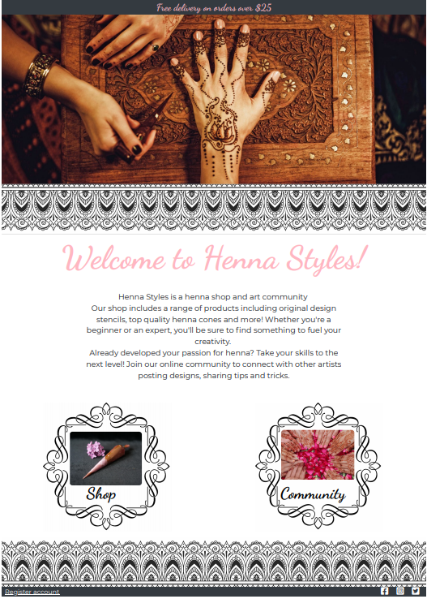

# __Henna Styles__

The past year of worldwide lockdowns has inspired many people to take up new hobbies and attempt beauty treatments at home,
 as they could no longer visit professionals. Henna Styles is an online henna shop and art community, which provides a range 
 of henna products visitors can purchase as well as providing a platform for people interested in henna design to improve their
 abilities and learn from each other.

- - - 

## __UX__

### __Value provided:__
#### __For users:__
- As a visitor with no previous experience with henna I would like to know more about it before purchasing.

- As a new user I want guidance on how to use the products effectively

- As a professional user and want to find a range of products in one place

- As a user who has some previous interest in henna I want to know what I have purchased before so I can repurchase easily

- As a professional user I want to see others work for inspiration

#### __For store owner:__ I want to maximise sales.
- I want to make sure all visitors know the range of products being sold.

- I want the user to have a positive response to the site and spend longer on it as this will motivate return visits.
  
- I want to increase the number of visitors who return to the site in order to gain repeat purchases.

### __Wireframes__
This section is also where you would share links to any wireframes, mockups, diagrams etc. that you created as part of the 
design process. These files should themselves either be included as a pdf file in the project itself (in an separate directory),
 or just hosted elsewhere online and can be in any format that is viewable inside the browser.
 
+ [Home wireframe](documentation/wireframes/home-wrf-img.PNG)
+ [Shop wireframe](documentation/wireframes/shop-wrf-img.PNG)
+ [Community wireframe](documentation/wireframes/community-wrf-img.PNG)
+ CHECKOUT view
+ PROFILE view
+ Add/Edit post view

### __Overall design__
+ In order to get an idea of the conventions of shopping/blog art sites I visited several online stores. The styling is simple
 when displaying products but other pages are loaded with colour and images, creating a positive response. Several of the more popular art 
 supply shops had sections which contained information and blog posts (like jackson art). I also viewed some online henna shops 
 which appeared to be for smaller companies as the style was very simplistic and none offered all the different types of products 
 offered on Henna Styles. Some of the sites used for inspiration include: [Jackson art](https://www.jacksonsart.com/),
 [Desenio](https://desenio.co.uk/), [Henna Shop](https://www.hennashop.co.uk/).

+ The colour scheme used for the site was created with coloors. The colours are simple including black, gray and shades of pink,
this was chosen in order to keep the pages simple while still vibrant and allow image pages to create a strong response in 
comparison. [Palette used](https://coolors.co/ffb6c1-d6d7d7-b27f87-210124-00171f).

- - - 
## Database Schema

Sql was used to create this database.

## ADD IMAGE OF DATABASE SCHEMA

---- 
## Features

### Sitewide Features:

- __Navigation bar:__
    - Top navigation bar is styled with the sites theme colours and contains 5 links. 
        - The first is the site logo which leads to the homepage. 
        - The next is the search bar, which allows users to search for products from anywhere on the site. 
        - The Account link is next, this displays links relevant to the current user. For anonymous users,
        the links avaliable are 'register' and 'login'. For authenticated users the links avalaible are 'my profile' and 'logout'.
        Superusers will also have access to 'product management' from the account section, where they can add products.
        - The Shopping bag link is next, the shopping bag totals are displayed and updated each time the user
        adds an item to their shopping bag.
        - The final link is for the community page
    - __Bottom Navigation bar:__
        - contains links to different product searches. The user can select a product category, subcategory or choose to 
        display all products by a preferred sorting method, such as low to high prices. 
        This part of the navigation bar is displayed in full on larger screens but toggles on small screens. 
        On small screens a home link is also displayed.
- __Delivery banner__ reminds user of the free delivery limit, which may incentivise them to buy more.
- __Pattern Borders__ decorate most pages, they are reminiscent of patterns created with henna and fits the site theme.
- Footer
    - Contains links to social media 
- Toasts
    - Toasts are displayed throughout the site based on user interactions. A summary of the bag is displayed when users alter
    its content. Errors and important general information is also displayed through toasts.

### Homepage:
- __Header image__ is of a desgin being created with henna. The hand being decorated is shown on an ornate box, with complex designs.
    The colours are dark and contrast with the rest of the site, drawing the users attention.
- __Heading and intro__. The heading is a large welcome message in the logo font and theme pink colour. The intro explains to the user
what is avalaible on the site. Henna products for purchase and a blog with further information and potential for interaction with other users.
- __Buttons__ Two buttons are avaliable on the homepage. One for shop and one for community. This guides users to either make a purchase 
or view the community page where they can gain some inspiration, which hopefully will lead them to purchase the products.

### Products pages:

- __All Products__
    - __Sorting dropdown selector__ allows the user to choose from a selection of sorting methods.
    Once a method is selected, the products are update and a link to 'products home' appears which allows them to reset the search, 
    they are also able to select a new search method from the selector if they like.
    - __Navigation category selection__ when a product category is selected from the navigation bar. All products
    in this category are displayed, links to subcategories are also displayed below the heading, allowing users to 
    narrow their search down further. Again, the product home link is avaliable on these pages to reset the search and 
    the sorting methods to organise the results.
    - __Product Results__ are made up of a large product image, the product name and price and a link to the category
    the product belongs to. Selecting a product takes the user to a product details page.
    - __Edit delete buttons for superuser__ When the user is a superuser, edit and delete links appear under each product allowing 
    them to easily edit and remove products from the site.

- __Product Details__
    - __Large product image and product details__ allows user to see details of the product clearly.
    Users can read the full product description and again, select the products category to view more products in the same category.
    - __Quanity selector__ allows the user to increase/decrease the quantity of the product they wish to purchase. The 
    value cannot be set below 1 so no errors occur when the product is added to the bag.
    - __Add to bag button__ adds the product to the shopping bag.
    - __Success toasts__ when a product is added to the page a toast pops up letting the user know they have 
    successfully added the product to the bag and also allows them to view a summary of what is currently in their bag as 
    well as the total due excluding delivery, and what they need to spend to get free delivery. Clicking on the toast takes the 
    user to their shopping bag and allows them to continue with the purchase.
    - __Keep Shopping button__ Allows the user to return easily to the main products page.

- __Edit/Add products__ these pages are only avaliable to superusers.
    - __Product Form__ consists of all fields required to create a new product. Category is selected through a drop down, containing 
    all categories. Edit form is prefilled with the product details so users can make edits quickly and easily.
    - __Product Image__ users are notified when uploading a new image what the file will be changed to, so they can see if a mistake is made.
    When the user is editing a product the current product image is shown as a preview.

### Shopping Bag page:
    - 

### Checkout page:
- __Order Summary:__ Shows the user their shopping bag and a breakdown of their order, delivery and total costs, before they complete their purchase.
- __Form__: Split into three sections, if any required fields are missed, the form cannot be submitted. Instead a popup appears at the missed field 
reminding the user to fill it in before submitting again. 
    - The first contains the users information such as email and name. 
    - Delivery information is the next section. If the user is logged in they are able to save this information so next time they make 
    a purchase, this part of the form will be prefilled. 
    - Stripe payment is the last section where users enter their card details and can complete their purchase. The 
    form cannot be submitted if the credit card number is not valid, instead the page will reload, alerting them of the 
    issue.
- __Loading overlay__: This is triggered when the form is submitted and shows the user their request is being processed. It consists of a 
black transparent overlay and a spinning loading icon in site colours.

### Checkout Success page:
- __Success toast__ assures the user their order has been processed, gives them the order number and alerts them that they have 
been sent a confirmation email. 
- __Heading and intro__ thanks the user for their purchase and confirms the email their order confirmation has been sent to.
- __Order summary__ shows all the order details including the order number, date, products purchased, delivery information and 
billing information.
- __Back to shop or community buttons__ guides the user to other parts of the site they can explore.
- If users have logged in when making purchases they will be able to access old order confirmations through their profile page, 
they are alerted through a toast that they are viewing a previous order. A link to go back to their profile page is also provided for these
users.

### Community pages:

- __Community page__ is avaliable for all users to view, however adding posts and comments is restricted to authorised users, any visitor to 
the page is made aware of this through a toast popup.
    - __Search posts__: Users are able to search for posts using keywords they are interested in. Submitting the search will return
    all relevant posts and also display a reset button to allow them to return to the main view.
    - __Add Post button__: Avaliable at the top of the page so users can find it easily, takes the authenticated users to the add a post page
    and anonymous users to the login page.
    - __Posts__ consist of cards containing the post image, if it has one. The user who created it and a preview of the post so users can get an idea if it is 
    what they are looking for. The posts end with a button leading to the full post.
    - __Like and comment count__ On each post the number of likes and comments is also displayed so users know if there are comments to read 
    or whether or not the post is popular.
    - __Edit/Delete Buttons__ are only visible to the creator of the post, allowing them to remove or edit it. Delete post buttons are also 
    avaliable to superusers in order to allow them to regulate what is posted.

- __Post detail page__ avaliable for all users to view, however adding comments or likes is restricted to only authorised users.
    - __Post heading, image and body__: The heading is styled using the logo font. For posts with images, the image is displayed prominently and
    the full post is avaliable to read.
    - __Like button__: Shows the current number of likes. It also allows logged in users to like or unlike a post, which triggers a page reload 
    with a toast notifying the user that their like has been added and the like count will also increase.
    - __Comment button and form__:When pressed, by an authenticated user, toggles a collapsible at the bottom of the page with the comment form so the 
    user can add a comment.
    - __Comments__: Show the comment author section in different colours, depending on if they are a superuser, the post creator or a general user. 
        - __Edit/Delete buttons__ are avaliable to the creators of comments. The edit button produces the comment form, prefilled and allows the user to make 
        an adjustment. The delete comment button is also avaliable to superusers to allow them to regulate comments.
        
- __Add/Edit a post page__ is displayed simply with the logo font used for the heading and the pattern border page decoration.
    - __Post Form__ cannot be submitted without being fully filled in. The name of the file image chosen for the post is displayed once 
    one is selected. Edit form is prefilled for ease of adjustment and a pop up toast appears when the page is loaded alerting the user that 
    they are editing their post.

### __Profile page:__ is only avaliable when a user is authorised and they only have access to their own profile page.
- __User Profile Form__ allows a user to add/adjust their default shipping information to make checkout faster and easier.
- __Order Summary__ is originally hidden when the page is loaded. Allows the user to bring up a summary of their previous orders 
as well as select an order to view it's confirmation and full details.
- __Liked Posts__ are orginially hidden when the page loads. Allows a user to view the heading of their liked posts so they can return to them easily, 
they are also able to remove the like and therefore the post from their profile.

### __Security Features:__
- All forms must be submitted with all required fields filled or they will not be put into the database
- Only authenticated users are allowed to create posts, if an anonymous user types the correct url they will be diverted to the login page. Only the
post creator is allowed to edit the post so others can't tamper with their post.
- Only authenticated users are allowed to add comments and likes, prevents any user from adding to the database.
- All auth is used for user verification, an anonymous user cannot access another users profile page.

## Features Left to Implement 
- Adding alerts to user's profile when someone comments on a users post
- Add ability to log in through social media

## Technologies used 
 - __Balsamic__ was used to create the wireframes for this project.
 - __Html 5__ was used to create the templates for the site.
 - __Bootstrap__ was used to structure HTML and for some responsive components.
 - Jinja was used to to templates
 - __Python__ was used to write the logic for the app
 - __Javascript__ was used to add interactive features to components
 - __CSS__ was used to style the site
 - Django was used 
 - All Auth
 - __Stripe__ was used to handle payments for the store
 - __Heroku__ was used to host the deployed site.
 - __Heroku Postgres__ was used to hold database
 - __AWS__ was used to store website images and static files
 - __FontAwesome__ was used for it's icons throughout the site
 - __Googlefonts__ was used for the logo font and main site font
 - Html validator
 - Pylint for Django

## Testing

VALIDATOR RESULTS

### TESTING USER STORIES NEEDS ARE MET

- As a visitor with no previous experience with henna I would like to know more about it before purchasing.
    - The homepage will address this as soon as a visitor lands on the site. The homepage will contain a link to the community 
    section and shop so visitors can find further information if they need to before they buy.
    
- As a new user I want guidance on how to use the products effectively
    - The community section will address this. People will be able to view henna related posts from other users or site owners and search for 
    posts on specific topics using the search bar on this page. Knowing more will encourage them to make purchases and experiment 
    with extra products. In order to ask questions of the community however they will have to create an account.
    
- As a professional user and want to find a range of products in one place
    - The homepage will contain a link to the shop and the types of different products will be displayed on the navigation bar 
    throughout the site so visitors can find what they are looking for quickly from anywhere. The navigation bar contains a range of
    ways to locate the product you need quickly, including categories, subcategories and the product search bar.
    
- As a user who has some previous interest in henna I want to know what I have purchased before so I can repurchase easily
    - When making a purchase, customers can create an account which will hold their preferred shipping details and an order history. 
    This will be available only by logging in when making a purchase.
    
- As a professional user I want to see others work for inspiration
    - Community page will allow people to view others' work, however to gain the full effect of the community (respond to 
    and create posts), users will have to log in.
#### __For store owner:__ I want to maximise sales.
- I want to make sure all visitors know the range of products being sold.
    - Site navigation will contain the main categories of products sold and will be available throughout the site. Users can choose
    whether to look through all the products or search for something specific.
    
- I want the user to have a positive response to the site and spend longer on it as this will motivate return visits.
    - Users will be able to view the community page where they can interact with others which will produce a positive response and 
    lead them to stay on the site longer. They are made aware that they must create an account to access all actions when first visiting 
    the community page.
    
- I want to increase the number of visitors who return to the site in order to gain repeat purchases.
    - The profile page contains an order history and liked posts. Customers are likely to return again if they liked a product to 
    repurchase it. Also if the user has chosen to engage with the community, they are more likely to return to see more posts or 
    view replies to their posts or comments. 
    

## Testing functionality and responsive design

### Site wide features
- __Navigation bar:__ to test this I manually pressed each link on the nagivation page, both as an anonymous user and as an existing user 
as the links avaliable are different. The process below was repeated on both large screen version of the site and mobile to ensure the
toggle menu was working well.
    - Functionality: Before logging in:
    I clicked on each link on top navigation. 
    The logo led to the homepage successfully, the accounts button produced a dropdown when clicked which gave the options of "Register" and 
    "Login", both links led to the correct page. The shopping bag button led to the shopping bag page, the community button led to the community 
    page. To test the search function worked, I typed in 'cones', which is a word used in several products, this led to the products page with the
    products filtered to only show those containing the word. 
    Next I clicked each link on the product navigation.
    Each category link displayed a dropdown of subcategories when pressed, I pressed the link for each subcategory and the product results 
    adjusted correctly based on the subcategory.
    - Functionality: After logging in:
    I clicked on the account button, where the links displayed were "My Profile" and "Logout", both when selected led to the correct page.
    -Responsive design:
    The toggle button displayed on smaller screen widths, produced the products nagivation when pressed and all links were functional.

- __Footer:__ to test this I selected each link to ensure they led to the correct page and opened in a new tab.
    - Functionality: Each link led to the correct social media platform and opened in a new tab.

### Homepage

- __Header image, heading and intro__
    - __Responsive design:__ to test this, I used the google inspector tool to view the website on different screensizes.
    I viewed the image on ensure the image was displayed well. The image resolution was good on all screen sizes.
    The welcome text size was reduced on smaller screen sizes.
- __Buttons__ 
    - __Functionality:__ I pressed on each of the buttons. The shop button led to the products and the community button to the 
    main community page.
    - __Responsive design:__ The buttons stacked on mobile screens and where displayed side by side on tablet and laptop.
    
### Products page
    - __Sorting dropdown selector__ to test this I selected each option from the product sorting drop down to see the results.
        -__Functionality:__ The sorting worked for all of the options price, category and name sorting. The results were organised
        as selected. The selector was functional no matter what category of products were being displayed or when the product results 
        were from a search query. The 'product home' button appeared as expected when product sorting or filtering had taken place and 
        reset the product page when pressed.
    - __Product Results__ 
        -__Functionality:__ was tested by ensuring all product information was appearing correctly. I pressed the link to the product 
        category under each product which led to the products page, displaying all products in that category. I pressed on the product
        image which led to the product's details page.
        -__Responsive Design:__ I viewed the products page on different screen sizes. The products appeared in a row of four on extra large
         screens, three in a row on laptops, two on tablets and one per row on mobile screens. 
    - __Edit delete buttons for superuser__ to test this I logged into the site as a superuser, the products edit/delete links were under
        all the products and led to the edit page for that product with the information prefilled. I added a test product and was able to 
        delete it using the delete link.

- __Product Details__ to test this I repeated the procedure below with a product with no colour options and one with colour option.
    - __Large product image and product details__ 
        -__Functionality:__ I pressed the image which opened up the image in a new tab.
        -__Responsive Design:__ Product image displayed well on all screen sizes, maintaining the ability of users to see finer
        product details. Image stacked over product details on smaller screens and was displayed beside them on tablet screens and
         above.
    - __Quanity selector__ 
        - __Functionality:__ 
            - I pressed the minus button on the quantity form when the current number was one, to ensure a quantity of 0 couldnt be set by the selector, 
            the quantity didn't change.
            - I pressed the increase button and the quantity went up.
            - I changed the current value of the selector to 99 and pressed the plus button again as this was the maximum value set,
            the quantity didn't change.
            - I changed the current value of the selector to 100 and tried to submit the form, the result was a popup at the quantity
            input telling me the value must be less than or equal to 99.
            - I changed the current value of the selector to 0 and tried to submit the form, the result was a popup at the quantity 
            input telling me the value must be greater than or equal to one.
            - I set the current value to 3 and added the product to the bag, the quantity was reflected in the shopping bag and current total.
    - __Colour selector__:
        - __Functionality__:
            - I selected a colour for the product and added it to the bag, the product with the colour detail was added to the shopping bag.
            - I selected a different colour of the same product and added it to the bag, the product displayed seperately with the correct colour shown 
            in the details.
    - __Add to bag button and success toasts__ :
        - __Functionality__: 
            - I pressed this button, a toast appeared at the shopping bag icon in the navigation alerting me the product had been
            added to my shopping bag and a summary of the bag was also shown with the correct product and quanity/colour specifications inside. 
    - __Keep Shopping button__:
        -__Functionality__:
            - I pressed this button and was directed back to the products homepage.
    
    

## Bugs

## Deployment

MEDIA : 
MAIN BORDER USED<a href="https://www.freepik.com/vectors/frame">Frame vector created by pch.vector - www.freepik.com</a>
LINK FOR SHOP BUTTON HENNA CONE : https://bluelotushenna.com/product/henna-cone-regular-1-oz/
LINK FOR BORDER: Image by <a href="https://pixabay.com/users/gdj-1086657/?utm_source=link-attribution&amp;utm_medium=referral&amp;utm_campaign=image&amp;utm_content=3166177">Gordon Johnson</a> from <a href="https://pixabay.com/?utm_source=link-attribution&amp;utm_medium=referral&amp;utm_campaign=image&amp;utm_content=3166177">Pixabay</a>
HOME IMAGE: https://www.salongold.co.uk/wp-content/uploads/2019/04/henna-art-1920x1080.jpg